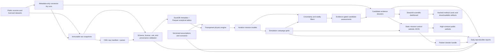

# System Architecture

## Component Decisions

- **Python 3.11+** is the initial implementation language.
- **Pydantic** enforces contracts at configuration and API boundaries.
- **DuckDB** stores normalized metadata and queries local Parquet efficiently.
- **Parquet** is reserved for larger analytical tables and immutable snapshots.
- **Streamlit** provides a low-cost scientific dashboard while the research
  engine is immature.
- **Static HTML/CSS/JavaScript** provides a polished public mission-control
  surface over generated JSON without adding a frontend build pipeline.
- **Simulation campaign grids** map aviation requirement envelopes, pack
  architecture sensitivities, and candidate evidence boundaries without
  promoting those sweeps to experimental performance evidence.
- **CMU measurement ingestion** downloads approved raw files only on explicit
  command, verifies supplied MD5 and computed SHA-256 hashes, parses
  representative CSVs, and labels outputs as cell-level evidence only.
- **Manufacturer and propulsion registries** provide source-labeled context for
  aircraft and powertrain examples without treating public claims as battery
  validation.
- **Partner dossier generation** consumes registries, measurement summaries, and
  simulation artifacts to create factual briefs and archive significant changes.
- **Plotly** provides traceable interactive scientific charts without requiring
  a separate front-end application.
- **Rust or Julia** is deferred until profiling identifies a kernel whose
  runtime materially blocks research.
- **GitHub Actions** validates registries and tests equations on every change.

## Provenance Path

Each public number must be traceable through:

`report/chart -> assessment -> simulation or measurement -> assumptions ->
source snapshot -> citation/license metadata`.

Phase 4 fixture charts currently follow:

`chart -> hashed result JSON -> versioned scenario/config -> equation code ->
method card -> limitations`.

The static website follows:

`website chart -> website/mission-control-data.json -> dashboard manifest ->
hashed Phase 2/3 artifacts -> versioned configs -> method cards -> limitations`.

Simulation campaign panels follow:

`website simulation panel -> website/mission-control-data.json ->
reports/simulations -> configured mission scenarios + simulation code ->
limitations`.

Candidate dossier cards follow:

`website candidate card -> website/mission-control-data.json -> reports/candidates
-> registry chemistry family + metadata appendix -> source status + limitations`.

CMU measurement panels follow:

`website measurement panel -> website/mission-control-data.json ->
reports/measurements -> data/raw/approved/cmu_evtol_battery -> approved CMU
source metadata manifest -> CC BY 4.0 source record`.

Partner dossiers follow:

`reports/partners/latest -> reports/partners/archive -> registries + CMU
measurement summary + simulation campaign artifacts + website data hashes`.
