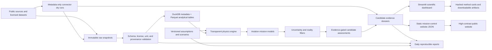

# System Architecture

## Component Decisions

- **Python 3.11+** is the initial implementation language.
- **Pydantic** enforces contracts at configuration and API boundaries.
- **DuckDB** stores normalized metadata and queries local Parquet efficiently.
- **Parquet** is reserved for larger analytical tables and immutable snapshots.
- **Streamlit** provides a low-cost scientific dashboard while the research
  engine is immature.
- **Static HTML/CSS/JavaScript** provides a polished public mission-control
  surface over generated JSON without adding a frontend build pipeline.
- **Plotly** provides traceable interactive scientific charts without requiring
  a separate front-end application.
- **Rust or Julia** is deferred until profiling identifies a kernel whose
  runtime materially blocks research.
- **GitHub Actions** validates registries and tests equations on every change.

## Provenance Path

Each public number must be traceable through:

`report/chart -> assessment -> simulation or measurement -> assumptions ->
source snapshot -> citation/license metadata`.

Phase 4 fixture charts currently follow:

`chart -> hashed result JSON -> versioned scenario/config -> equation code ->
method card -> limitations`.

The static website follows:

`website chart -> website/mission-control-data.json -> dashboard manifest ->
hashed Phase 2/3 artifacts -> versioned configs -> method cards -> limitations`.

Candidate dossier cards follow:

`website candidate card -> website/mission-control-data.json -> reports/candidates
-> registry chemistry family + metadata appendix -> source status + limitations`.
